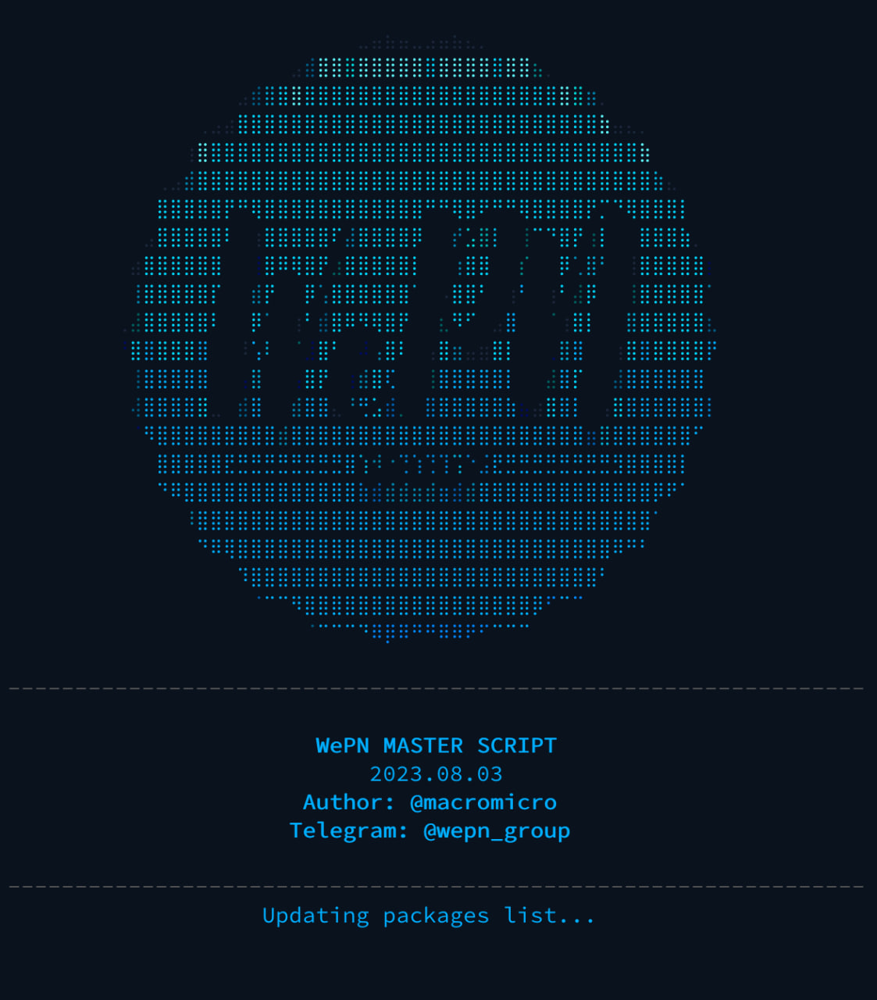
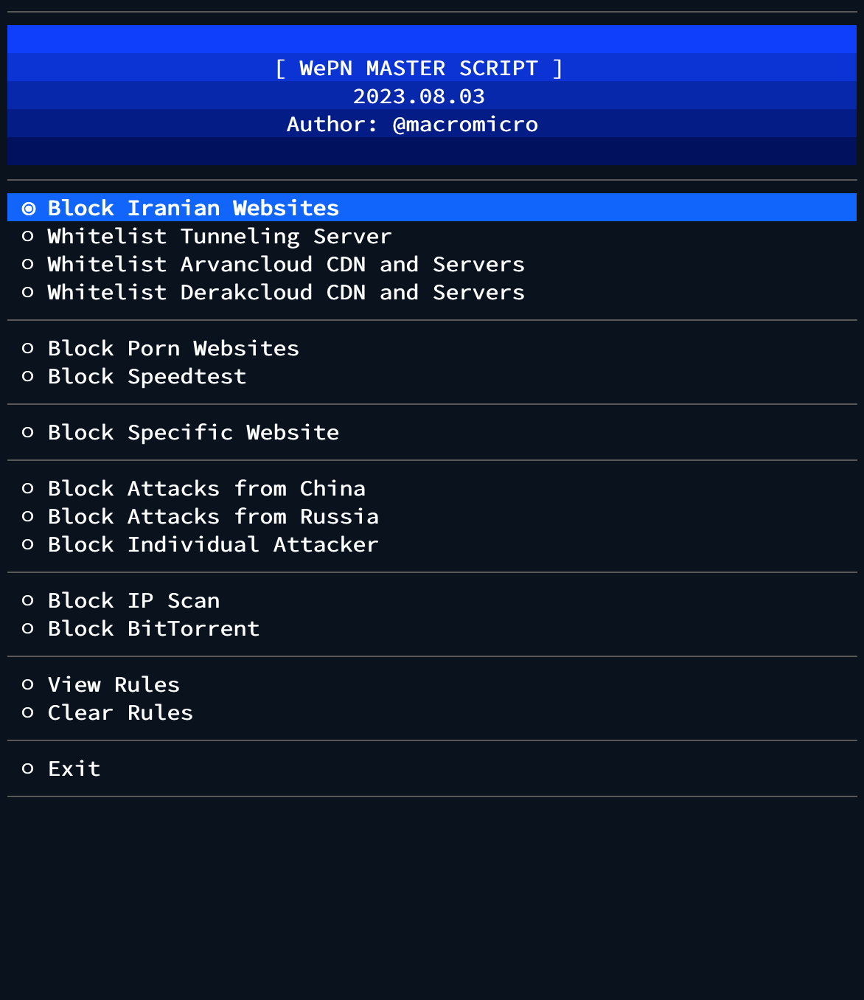

# WePN MASTER SCRIPT

<div style="display: flex;">
  
  
</div>

## Installation

#### Ubuntu 18.04, Ubuntu 20.04, Ubuntu 22.04, Ubuntu 22.10, Debian 10 and Debian 11
```bash
bash <(curl -s https://raw.githubusercontent.com/elemen3/wepn/master/wepn.sh)
